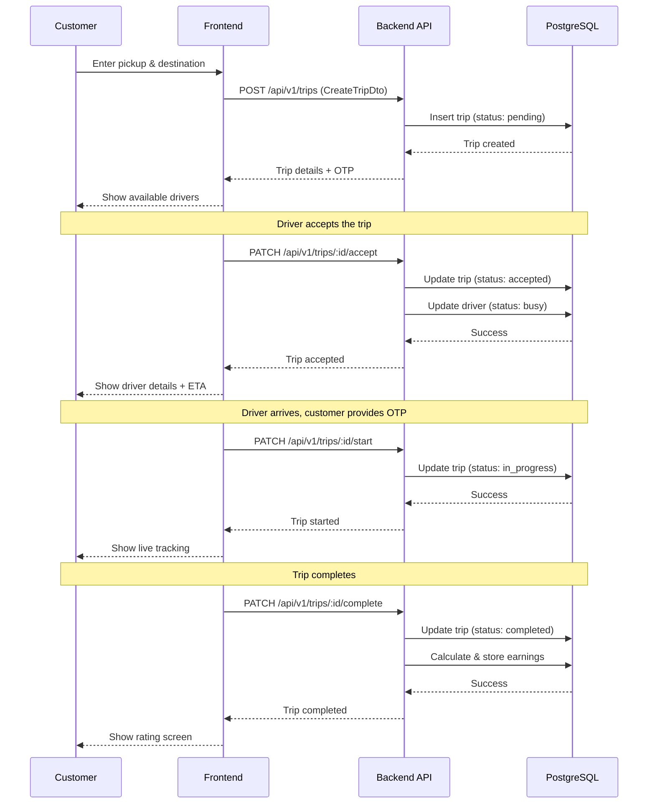
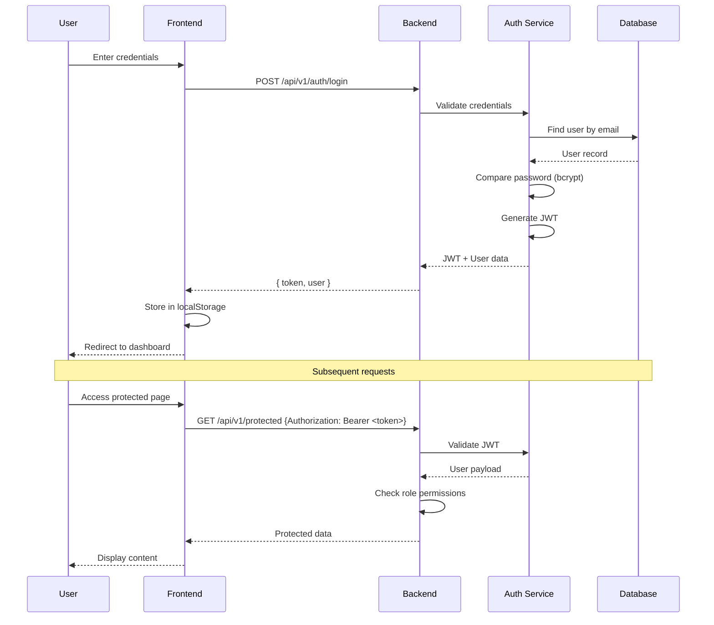
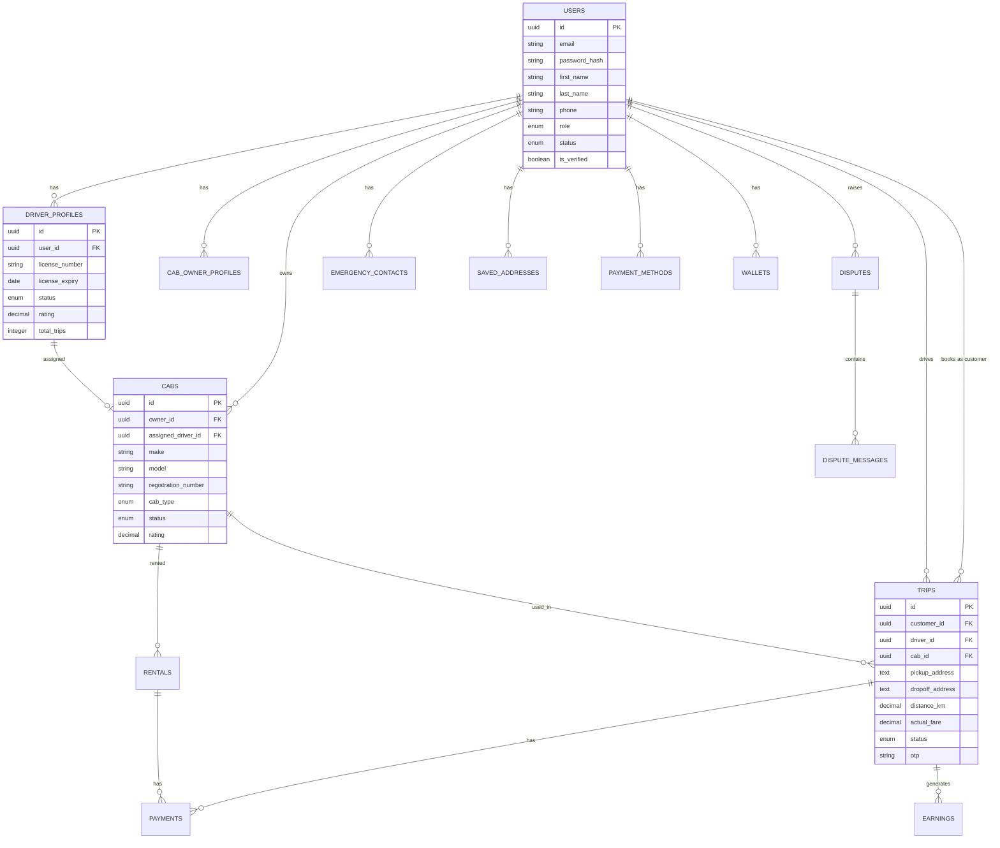
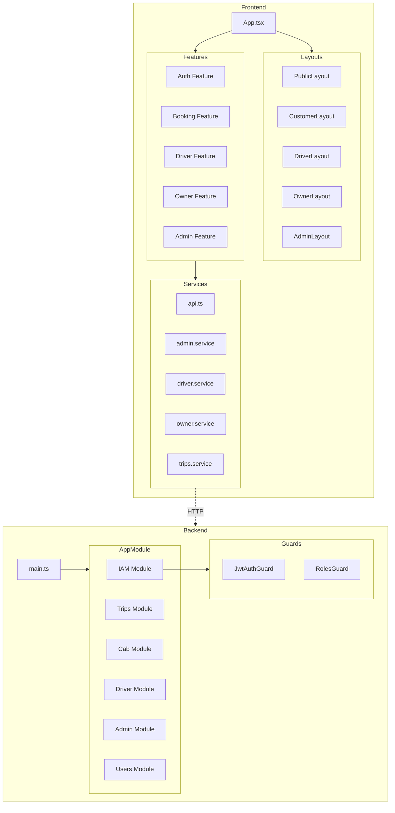

# 🏗️ Architecture Guide

> Technical deep-dive into the Jez Cabs Management Platform architecture, design decisions, and implementation patterns.

---

## 📋 Table of Contents

- [System Design](#-system-design)
- [Directory Structure](#-directory-structure)
- [Data Flow Diagram](#-data-flow-diagram)
- [Core Components & Relations](#-core-components--relations)
- [Authentication Architecture](#-authentication-architecture)
- [Database Design](#-database-design)
- [API Design Patterns](#-api-design-patterns)
- [Frontend Architecture](#-frontend-architecture)
- [State Management](#-state-management)
- [Deployment Architecture](#-deployment-architecture)

---

## 🎯 System Design

### High-Level Architecture

The Jez Cabs platform follows a **modular monolith** architecture pattern, which provides the benefits of microservices (clear module boundaries, single responsibility) while maintaining the simplicity of a monolithic deployment.

```
┌─────────────────────────────────────────────────────────────────────────────┐
│                              CLIENT LAYER                                    │
├─────────────────────────────────────────────────────────────────────────────┤
│                                                                              │
│   ┌─────────────┐  ┌─────────────┐  ┌─────────────┐  ┌─────────────┐        │
│   │   Customer  │  │   Driver    │  │  Cab Owner  │  │    Admin    │        │
│   │     SPA     │  │     SPA     │  │     SPA     │  │     SPA     │        │
│   │  (React 19) │  │  (React 19) │  │  (React 19) │  │  (React 19) │        │
│   └──────┬──────┘  └──────┬──────┘  └──────┬──────┘  └──────┬──────┘        │
│          │                │                │                │               │
│          └────────────────┴────────────────┴────────────────┘               │
│                                    │                                         │
│                           React Router v7                                    │
│                         Role-Based Routing                                   │
│                                                                              │
└─────────────────────────────────────────────────────────────────────────────┘
                                     │
                              HTTPS / REST
                                     │
                                     ▼
┌─────────────────────────────────────────────────────────────────────────────┐
│                              API GATEWAY LAYER                               │
├─────────────────────────────────────────────────────────────────────────────┤
│                                                                              │
│   ┌─────────────────────────────────────────────────────────────────────┐   │
│   │                         NestJS Application                           │   │
│   │                                                                      │   │
│   │  ┌──────────────┐  ┌──────────────┐  ┌──────────────┐               │   │
│   │  │  JWT Guard   │  │ Rate Limiter │  │  Validation  │               │   │
│   │  │  (Passport)  │  │ (Throttler)  │  │    Pipe      │               │   │
│   │  └──────────────┘  └──────────────┘  └──────────────┘               │   │
│   │                                                                      │   │
│   │  ┌──────────────┐  ┌──────────────┐  ┌──────────────┐               │   │
│   │  │ Roles Guard  │  │  CORS Layer  │  │   Swagger    │               │   │
│   │  │              │  │              │  │    Docs      │               │   │
│   │  └──────────────┘  └──────────────┘  └──────────────┘               │   │
│   │                                                                      │   │
│   └─────────────────────────────────────────────────────────────────────┘   │
│                                                                              │
└─────────────────────────────────────────────────────────────────────────────┘
                                     │
                                     ▼
┌─────────────────────────────────────────────────────────────────────────────┐
│                           BUSINESS LOGIC LAYER                               │
├─────────────────────────────────────────────────────────────────────────────┤
│                                                                              │
│   ┌──────────┐ ┌──────────┐ ┌──────────┐ ┌──────────┐ ┌──────────┐         │
│   │   IAM    │ │  Trips   │ │   Cabs   │ │  Driver  │ │  Admin   │         │
│   │ Module   │ │  Module  │ │  Module  │ │  Module  │ │  Module  │         │
│   │          │ │          │ │          │ │          │ │          │         │
│   │• Auth    │ │• Create  │ │• CRUD    │ │• Profile │ │• Stats   │         │
│   │• Register│ │• Accept  │ │• Assign  │ │• Onboard │ │• Verify  │         │
│   │• JWT     │ │• Track   │ │• Status  │ │• Status  │ │• Users   │         │
│   │• Roles   │ │• Complete│ │• Filters │ │• Location│ │• Reports │         │
│   └──────────┘ └──────────┘ └──────────┘ └──────────┘ └──────────┘         │
│                                                                              │
│   ┌──────────┐ ┌──────────┐ ┌──────────┐ ┌──────────┐ ┌──────────┐         │
│   │ Rentals  │ │ Disputes │ │  Safety  │ │Community │ │  Users   │         │
│   │ Module   │ │  Module  │ │  Module  │ │  Module  │ │  Module  │         │
│   │          │ │          │ │          │ │          │ │          │         │
│   │• Create  │ │• File    │ │• Contacts│ │• Post    │ │• Profile │         │
│   │• Confirm │ │• Resolve │ │• SOS     │ │• Book    │ │• Wallet  │         │
│   │• Cancel  │ │• Status  │ │• Primary │ │• History │ │• Payment │         │
│   │• History │ │• Messages│ │• Notify  │ │• Cancel  │ │• Address │         │
│   └──────────┘ └──────────┘ └──────────┘ └──────────┘ └──────────┘         │
│                                                                              │
└─────────────────────────────────────────────────────────────────────────────┘
                                     │
                    ┌────────────────┼────────────────┐
                    │                │                │
                    ▼                ▼                ▼
┌─────────────────────────────────────────────────────────────────────────────┐
│                            DATA ACCESS LAYER                                 │
├─────────────────────────────────────────────────────────────────────────────┤
│                                                                              │
│   ┌─────────────────────┐  ┌─────────────────────┐  ┌──────────────────┐    │
│   │      TypeORM        │  │      Mongoose       │  │  Supabase Client │    │
│   │                     │  │                     │  │                  │    │
│   │  - Entities         │  │  - Schemas          │  │  - Direct API    │    │
│   │  - Repositories     │  │  - Models           │  │  - RLS Policies  │    │
│   │  - Relations        │  │  - Embedded Docs    │  │  - Auth Context  │    │
│   │                     │  │                     │  │                  │    │
│   └──────────┬──────────┘  └──────────┬──────────┘  └────────┬─────────┘    │
│              │                        │                      │              │
│              ▼                        ▼                      ▼              │
│   ┌─────────────────────┐  ┌─────────────────────┐  ┌──────────────────┐    │
│   │    PostgreSQL       │  │      MongoDB        │  │      Redis       │    │
│   │    (Supabase)       │  │    (Atlas/Local)    │  │      Cache       │    │
│   │                     │  │                     │  │                  │    │
│   │  • Users            │  │  • Notifications    │  │  • Sessions      │    │
│   │  • Trips            │  │  • Activity Logs    │  │  • Rate Limits   │    │
│   │  • Cabs             │  │  • Audit Trail      │  │  • Hot Data      │    │
│   │  • Rentals          │  │                     │  │                  │    │
│   │  • Payments         │  │                     │  │                  │    │
│   │  • Disputes         │  │                     │  │                  │    │
│   └─────────────────────┘  └─────────────────────┘  └──────────────────┘    │
│                                                                              │
└─────────────────────────────────────────────────────────────────────────────┘
```

### Design Decisions

| Decision | Rationale |
|----------|-----------|
| **Modular Monolith** | Easier to deploy and maintain than microservices, while still providing clear boundaries |
| **Dual Database** | PostgreSQL for transactional data (ACID compliance), MongoDB for unstructured data (logs, notifications) |
| **Supabase** | Managed PostgreSQL with built-in Row Level Security, reducing infrastructure overhead |
| **NestJS** | Enterprise-ready patterns (DI, decorators, modules) that scale with team size |
| **React + Vite** | Fast development experience with HMR, optimized production builds |
| **Feature-based structure** | Each feature is self-contained with its own components, hooks, and services |

---

## 📁 Directory Structure

### Backend Structure Philosophy

```
backend/src/
├── common/                 # Cross-cutting concerns
│   ├── decorators/        # Custom decorators (@CurrentUser, @Roles, @Public)
│   ├── enums/            # Shared enumerations (UserRole, TripStatus, etc.)
│   ├── filters/          # Exception filters for consistent error responses
│   ├── guards/           # Auth guards shared across modules
│   ├── interceptors/     # Logging, transformation interceptors
│   └── supabase.module.ts # Supabase client provider
│
├── config/                # Configuration modules
│   ├── database.config.ts    # TypeORM PostgreSQL configuration
│   ├── mongodb.config.ts     # Mongoose configuration
│   ├── jwt.config.ts         # JWT secret and expiration
│   └── supabase.config.ts    # Supabase credentials
│
├── health/                # Health check endpoints for monitoring
│   ├── health.controller.ts
│   └── health.module.ts
│
├── modules/               # Feature modules - the core business logic
│   │
│   ├── iam/              # Identity & Access Management
│   │   ├── controllers/
│   │   │   ├── auth.controller.ts      # Login, Register, Profile
│   │   │   └── index.ts
│   │   ├── entities/
│   │   │   └── user.entity.ts          # Core user entity
│   │   ├── guards/
│   │   │   ├── jwt-auth.guard.ts       # JWT verification guard
│   │   │   └── roles.guard.ts          # Role-based access control
│   │   ├── services/
│   │   │   └── auth.service.ts         # Authentication business logic
│   │   └── strategies/
│   │       └── jwt.strategy.ts         # Passport JWT strategy
│   │
│   ├── trips/            # Trip lifecycle management
│   │   ├── dto/
│   │   │   ├── create-trip.dto.ts
│   │   │   ├── accept-trip.dto.ts
│   │   │   └── ...
│   │   ├── entities/
│   │   │   └── trip.entity.ts
│   │   ├── trips.controller.ts
│   │   ├── trips.service.ts
│   │   └── trips.module.ts
│   │
│   ├── cab/              # Vehicle fleet management
│   │   ├── controllers/
│   │   │   ├── cab.controller.ts       # CRUD operations
│   │   │   └── owner.controller.ts     # Owner-specific operations
│   │   ├── dto/
│   │   ├── entities/
│   │   │   ├── cab.entity.ts
│   │   │   └── cab-owner-profile.entity.ts
│   │   └── services/
│   │       ├── cab.service.ts
│   │       └── owner.service.ts
│   │
│   ├── driver/           # Driver operations
│   │   ├── controllers/
│   │   │   └── driver.controller.ts
│   │   ├── dto/
│   │   │   └── driver-onboarding.dto.ts
│   │   ├── entities/
│   │   │   └── driver-profile.entity.ts
│   │   └── services/
│   │       └── driver.service.ts
│   │
│   ├── admin/            # Admin dashboard operations
│   │   ├── admin.controller.ts
│   │   ├── admin.service.ts
│   │   └── entities/
│   │       └── verification.entity.ts
│   │
│   ├── users/            # User profile & preferences
│   ├── rentals/          # Vehicle rental management
│   ├── disputes/         # Dispute resolution
│   ├── safety/           # Emergency contacts & SOS
│   ├── community/        # Ride-sharing exchange
│   ├── notification/     # Push notifications
│   ├── payments/         # Payment processing (stub)
│   └── earnings/         # Driver earnings (stub)
│
├── app.module.ts          # Root module - imports all feature modules
├── app.controller.ts      # Health check endpoint
├── app.service.ts
└── main.ts               # Bootstrap with Swagger, CORS, validation
```

### Why This Structure?

1. **Module Isolation**: Each module is self-contained with its own controller, service, DTOs, and entities
2. **Clear Dependencies**: Modules only import what they need via NestJS DI
3. **Testability**: Each module can be tested in isolation
4. **Scalability**: Easy to extract modules into microservices if needed

### Frontend Structure Philosophy

```
frontend/src/
├── components/            # Shared UI components
│   └── ui/               # Radix-based primitives
│       ├── button.tsx
│       ├── card.tsx
│       ├── dialog.tsx
│       ├── input.tsx
│       └── ...
│
├── contexts/             # React contexts for global state
│   └── ThemeContext.tsx  # Dark/light mode management
│
├── features/             # Feature-based modules
│   │
│   ├── auth/            # Authentication feature
│   │   ├── components/
│   │   │   ├── LoginForm.tsx
│   │   │   ├── RegisterForm.tsx
│   │   │   └── AuthModal.tsx
│   │   ├── contexts/
│   │   │   ├── AuthContext.tsx
│   │   │   └── AuthModalContext.tsx
│   │   ├── hooks/
│   │   │   ├── useAuth.ts
│   │   │   └── useAuthModal.ts
│   │   └── index.ts      # Public exports
│   │
│   ├── booking/         # Trip booking flow
│   │   └── components/
│   │       ├── LocationEntry.tsx
│   │       ├── CabSelection.tsx
│   │       ├── DriverSearch.tsx
│   │       ├── LiveTracking.tsx
│   │       └── TripComplete.tsx
│   │
│   ├── customer/        # Customer-specific pages
│   │   └── pages/
│   │       ├── Profile.tsx
│   │       ├── TripHistory.tsx
│   │       └── PlanTrip.tsx
│   │
│   ├── driver/          # Driver-specific pages
│   │   └── pages/
│   │       ├── Dashboard.tsx
│   │       ├── ActiveTrip.tsx
│   │       ├── Earnings.tsx
│   │       └── DriverOnboarding.tsx
│   │
│   ├── owner/           # Cab owner pages
│   │   └── pages/
│   │       ├── OwnerDashboard.tsx
│   │       ├── ManageCabs.tsx
│   │       ├── ManageDrivers.tsx
│   │       └── Contracts.tsx
│   │
│   ├── admin/           # Admin pages
│   │   └── pages/
│   │       ├── AdminDashboard.tsx
│   │       ├── AdminUsers.tsx
│   │       ├── AdminVerification.tsx
│   │       └── AdminReports.tsx
│   │
│   ├── public/          # Public-facing pages
│   │   └── pages/
│   │       └── Home.tsx
│   │
│   ├── disputes/        # Dispute management
│   ├── payments/        # Payment pages
│   ├── rentals/         # Rental management
│   ├── rideshare/       # Community features
│   └── safety/          # Safety center
│
├── layouts/             # Page layout wrappers
│   ├── AdminLayout.tsx
│   ├── CustomerLayout.tsx
│   ├── DriverLayout.tsx
│   ├── CabOwnerLayout.tsx
│   ├── PublicLayout.tsx
│   ├── ProtectedRoute.tsx    # Auth guard component
│   ├── Navbar/
│   └── Sidebar/
│
├── services/            # API service layer
│   ├── api.ts           # Axios instance with interceptors
│   ├── admin.service.ts
│   ├── cabs.service.ts
│   ├── driver.service.ts
│   ├── owner.service.ts
│   └── trips.service.ts
│
├── shared/              # Shared utilities
│   ├── api/            # API helpers
│   ├── constants/      # Route constants, enums
│   ├── hooks/          # Shared custom hooks
│   ├── types/          # Utility types
│   └── utils/          # Helper functions
│
├── styles/             # Global styles
│   └── index.css       # Tailwind imports
│
├── types/              # TypeScript type definitions
│   ├── index.ts        # Aggregated exports
│   ├── api.types.ts
│   ├── booking.types.ts
│   ├── driver.types.ts
│   └── payment.types.ts
│
├── App.tsx             # Root component with routing
└── main.tsx           # Application entry point
```

---

## 📊 Data Flow Diagram

### Trip Booking Flow



### Authentication Flow



---

## 🔧 Core Components & Relations

### Entity Relationship Diagram



### Module Dependencies



---

## 🔐 Authentication Architecture

### JWT Flow

```
┌──────────────────────────────────────────────────────────────────┐
│                      CLIENT (Browser)                             │
│                                                                   │
│   1. User login with email/password                               │
│   2. Receive JWT token                                            │
│   3. Store token in localStorage                                  │
│   4. Attach token to all requests via interceptor                 │
│                                                                   │
└────────────────────────────────┬─────────────────────────────────┘
                                 │
                     Authorization: Bearer <token>
                                 │
                                 ▼
┌──────────────────────────────────────────────────────────────────┐
│                      NESTJS BACKEND                               │
│                                                                   │
│   ┌─────────────────────────────────────────────────────────┐    │
│   │                    JwtAuthGuard                          │    │
│   │                                                          │    │
│   │  1. Extract token from Authorization header              │    │
│   │  2. Verify signature with JWT_SECRET                     │    │
│   │  3. Check expiration                                     │    │
│   │  4. Attach user payload to request                       │    │
│   │                                                          │    │
│   └─────────────────────────────────────────────────────────┘    │
│                              │                                    │
│                              ▼                                    │
│   ┌─────────────────────────────────────────────────────────┐    │
│   │                    RolesGuard                            │    │
│   │                                                          │    │
│   │  1. Extract required roles from @Roles() decorator       │    │
│   │  2. Compare with user.role from JWT payload              │    │
│   │  3. Allow or deny access                                 │    │
│   │                                                          │    │
│   └─────────────────────────────────────────────────────────┘    │
│                                                                   │
└──────────────────────────────────────────────────────────────────┘
```

### Role-Based Access Control (RBAC)

| Role | Routes | Capabilities |
|------|--------|--------------|
| `customer` | `/customer/*` | Book trips, rentals, payments, disputes |
| `driver` | `/driver/*` | Accept trips, manage profile, view earnings |
| `cab_owner` | `/owner/*` | Manage fleet, drivers, contracts |
| `admin` | `/admin/*` | Full platform access, verifications |
| `support` | `/admin/*` (limited) | Handle disputes, user queries |

---

## 💾 Database Design

### PostgreSQL (Supabase) - Primary Database

Stores all transactional data with ACID compliance:

- **Users & Profiles**: Core identity and role-specific data
- **Trips**: Complete trip lifecycle from booking to completion
- **Cabs**: Vehicle fleet inventory
- **Rentals**: Long-term and self-drive rentals
- **Payments**: Transaction records
- **Disputes**: Issue tracking and resolution

### MongoDB - Document Store

Used for unstructured and high-volume data:

- **Notifications**: Push notification history
- **Activity Logs**: User activity tracking
- **Audit Trail**: System event logging

### Redis - Cache Layer

- **Session Data**: JWT token blacklisting
- **Rate Limiting**: Request throttling counters
- **Hot Data**: Frequently accessed queries

---

## 🌐 API Design Patterns

### RESTful Conventions

```
GET    /api/v1/trips           # List all trips (filtered by user role)
POST   /api/v1/trips           # Create new trip
GET    /api/v1/trips/:id       # Get specific trip
PATCH  /api/v1/trips/:id       # Update trip
DELETE /api/v1/trips/:id       # Cancel/delete trip

# Sub-resource actions
PATCH  /api/v1/trips/:id/accept    # Driver accepts trip
PATCH  /api/v1/trips/:id/start     # Start trip with OTP
PATCH  /api/v1/trips/:id/complete  # Complete trip
POST   /api/v1/trips/:id/rate      # Rate the trip
```

### Response Format

```typescript
// Success Response
{
  "data": { ... },
  "message": "Operation successful"
}

// Error Response
{
  "statusCode": 400,
  "message": "Validation failed",
  "error": "Bad Request"
}
```

---

## ⚛️ Frontend Architecture

### Component Hierarchy

```
App
├── QueryClientProvider (TanStack Query)
│   └── ThemeProvider (Context)
│       └── BrowserRouter
│           └── AuthModalProvider
│               └── AuthProvider
│                   └── Routes
│                       ├── PublicRoutes
│                       │   └── PublicLayout
│                       │       └── Home
│                       ├── CustomerRoutes
│                       │   └── ProtectedRoute(customer)
│                       │       └── CustomerLayout
│                       │           ├── LocationEntry
│                       │           ├── CabSelection
│                       │           └── ...
│                       ├── DriverRoutes
│                       │   └── ProtectedRoute(driver)
│                       │       └── DriverLayout
│                       │           └── ...
│                       └── AdminRoutes
│                           └── ProtectedRoute(admin)
│                               └── AdminLayout
│                                   └── ...
```

### State Management Strategy

| Type | Solution | Use Case |
|------|----------|----------|
| Server State | TanStack Query | API data, caching, synchronization |
| Global Client State | Zustand | User session, UI preferences |
| Local Component State | useState | Form inputs, toggles |
| Complex Forms | React Hook Form + Zod | Form validation, submission |

---

## 🚀 Deployment Architecture

```
┌─────────────────────────────────────────────────────────────────┐
│                         PRODUCTION                               │
│                                                                  │
│   ┌─────────────────┐      ┌─────────────────┐                  │
│   │     Vercel      │      │    Railway      │                  │
│   │                 │      │                 │                  │
│   │   ┌─────────┐   │      │   ┌─────────┐   │                  │
│   │   │ Frontend│   │ ───► │   │ Backend │   │                  │
│   │   │ (React) │   │      │   │(NestJS) │   │                  │
│   │   └─────────┘   │      │   └─────────┘   │                  │
│   │                 │      │        │        │                  │
│   └─────────────────┘      └────────┼────────┘                  │
│                                     │                            │
│                    ┌────────────────┼────────────────┐          │
│                    │                │                │          │
│                    ▼                ▼                ▼          │
│           ┌─────────────┐  ┌─────────────┐  ┌─────────────┐    │
│           │  Supabase   │  │   MongoDB   │  │  Upstash    │    │
│           │ PostgreSQL  │  │    Atlas    │  │   Redis     │    │
│           └─────────────┘  └─────────────┘  └─────────────┘    │
│                                                                  │
└─────────────────────────────────────────────────────────────────┘
```

---

## 📚 Further Reading

- [NestJS Documentation](https://docs.nestjs.com/)
- [React Documentation](https://react.dev/)
- [Supabase Documentation](https://supabase.com/docs)
- [TanStack Query](https://tanstack.com/query/latest)

---

<p align="center">
  <i>Architecture documentation generated from codebase analysis</i>
</p>
